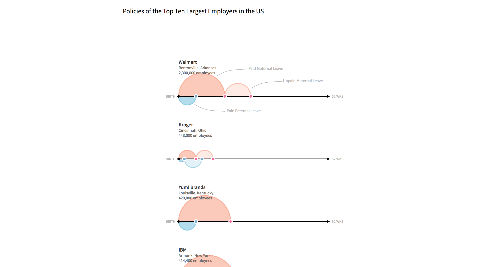
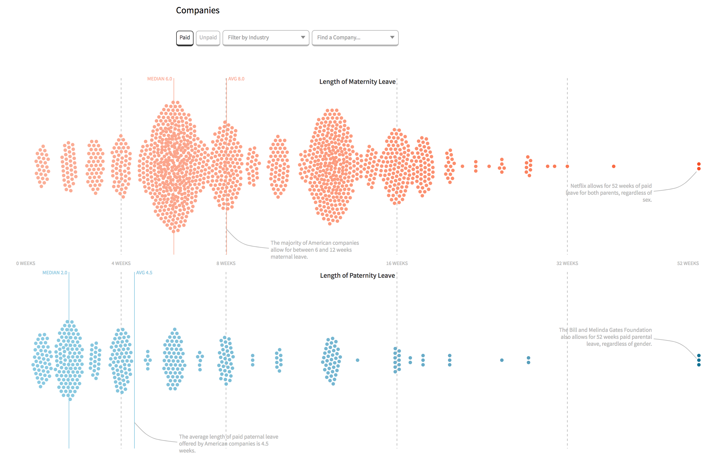
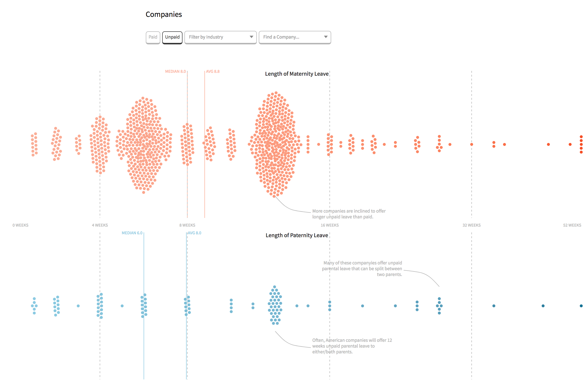
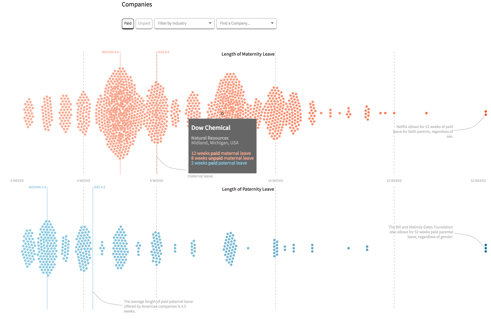
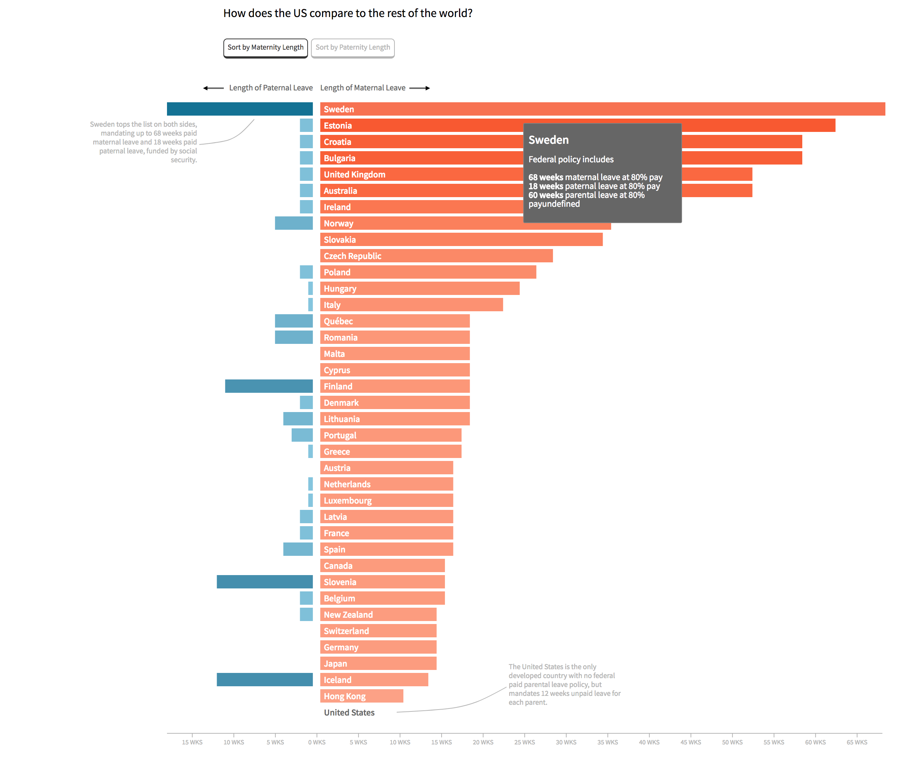
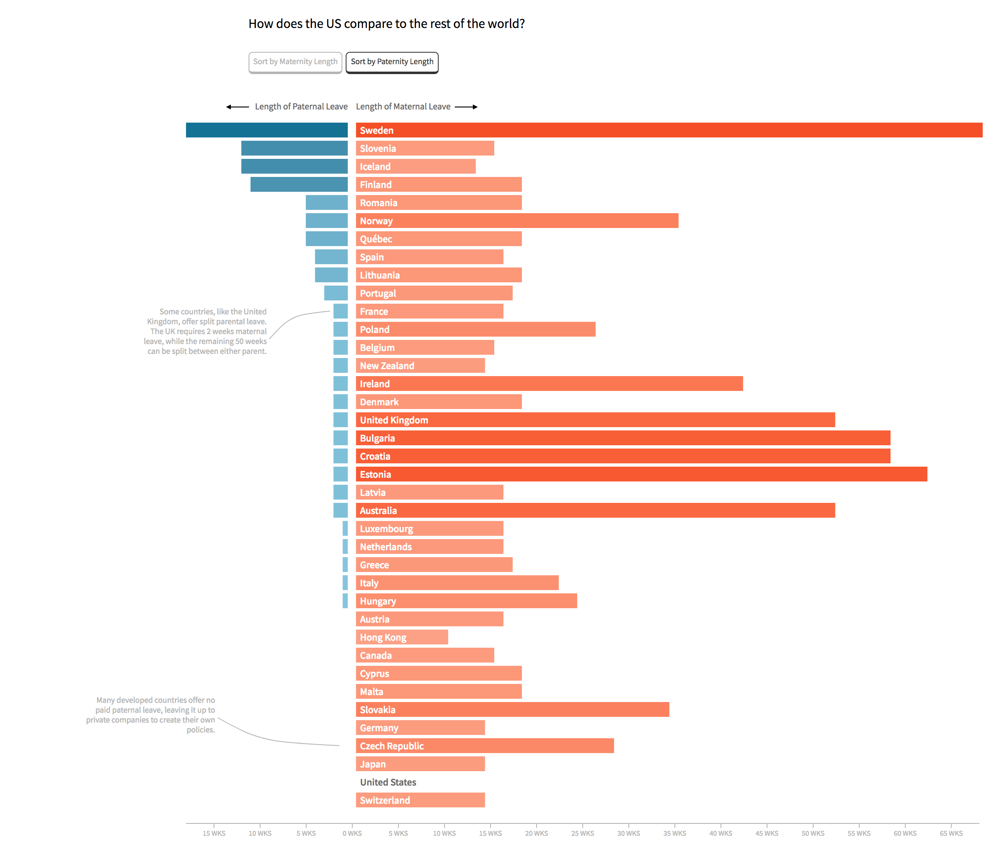

# Parental Leave

## Storyboard
#### Section One - Intro
Start off by talking about differences between paid and unpaid leave, why paid leave is so uncommon, how maternity and paternity leave differ. Introduce the comparisons by looking at the policies of the top ten largest employers in the US as an arc/timeline diagram, where the X axis is length of leave.

Reference:
* [*Upshot* article](https://www.nytimes.com/2018/01/24/upshot/parental-leave-company-policy-salaried-hourly-gap.html)
* [*Time* article](http://time.com/money/4573012/paid-leave-2016/)

Image

#### Section Two - Company Policies
Talk here about the varying policies at private companies and public organizations, point out averages and medians, what some companies are doing to improve. We could also talk about the way things have changed recently? I think also talking about the huge differences in maternity and paternity leave, both how long it is and how it's approached. Also mention here where this data is from and that it's crowdsourced from employees and not always accurately reflective of actual company policies. The chart here is an interactive beeswarm-timeline, where the X axis is again length of leave (0 weeks to 52) and the arcs represent the length of paid and unpaid maternity and paternity leave.

User controls allow to switch between paid and unpaid (with transitions), filter by industry, or search for a specific company, which will highlight on both swarms.

Image

#### Section Three - The Rest of the World
Here I want to talk about how the US compares tot he rest of the world. What do US's policies, both for mothers and fathers, look like compared to the rest of the developed world? In short, they're not good. But how much worse are they? Why is there no requirement for paid parental leave in the US and why is it up to private companies? Is anything changing?

This is a horizontal bar chart, with paternal leave on the left and maternal leave on the right. X axis is again length of leave, while each bar represents one of 38 developed countries (as defined by the UN). Users can sort by maternal or paternal, and maybe we can add in some hatches or like a second bar, or a filter, for each to show the percentage of wages that are paid??

Image

